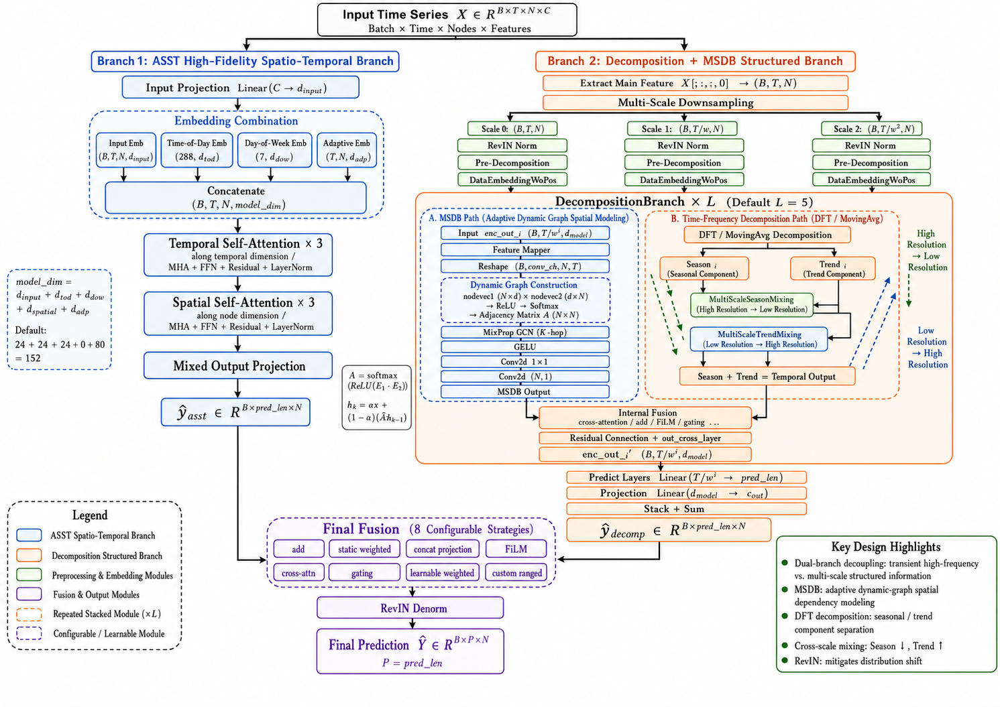

# TF-DuNet: A Time-Frequency Dual-Branch Network for Time Series Forecasting

<p align="center">
  <a href="README_ZH.md">简体中文</a> | English
</p>

<p align="center">
  
  
  
</p>

## Introduction

This is the official PyTorch implementation of **TF-DuNet**. Our work tackles a core challenge in time series forecasting: simultaneously modeling high-frequency, transient dynamics and quasi-stationary, multi-scale structures. TF-DuNet introduces a novel asymmetric dual-branch architecture to explicitly decouple and specialize in processing these two complementary information streams.

<p align="center">
  
</p>
<p align="center">
  <i>The architecture of TF-DuNet, featuring a high-fidelity temporal branch (ASST) and a structural time-frequency branch (Decomposition & MSDB).</i>
</p>

## Architecture

TF-DuNet employs a dual-branch architecture consisting of:

1.  **ASST Branch (Adaptive Sequential Spatio-Temporal block):** A high-fidelity temporal branch that uses self-attention to capture global spatio-temporal dependencies. It directly processes the input sequence to extract high-frequency and transient dynamics.
2.  **Decomposition Branch:** A structural time-frequency branch that decomposes the time series into trend and seasonal components (via DFT or Moving Average). It processes these components across multiple scales and models spatial dependencies using a dynamic graph-based Multi-Scale Spatial-Temporal Dependency Block (MSDB).

The outputs from these two specialized branches are then dynamically merged using configurable fusion strategies (e.g., addition, gating, film, or cross-attention) to generate the final prediction.

## Project Structure

```
.
├── dataset/            # Directory for datasets (needs to be downloaded manually)
├── models/             # Core model implementation
│   └── TF_DuNet.py     # Main model architecture (TF-DuNet)
├── layers/             # Custom neural network layers and blocks (ASST, MSDB, etc.)
├── data_provider/      # Data loading and preprocessing scripts
├── exp/                # Experiment runners (train, validate, test)
├── utils/              # Helper functions and metrics
├── run_PEMS08.py       # Main entry script for experiments
├── requirements.txt    # Python dependencies
├── README.md           # English Documentation
└── README_ZH.md        # Chinese Documentation
```

## Installation

### 1. Setup Environment
We recommend using Conda to manage your python environment.

```bash
conda create --name TF-DuNet python=3.8 -y
conda activate TF-DuNet
```

### 2. Install Dependencies

Install PyTorch (adjust the CUDA version based on your system):
```bash
pip install torch==2.1.0+cu118 torchaudio==2.1.0+cu118 torchvision==0.16.0+cu118 --index-url https://download.pytorch.org/whl/cu118
```

Install other required packages:
```bash
pip install -r requirements.txt
```
*(Alternatively, you can manually install the required packages listed in the previous README, such as `numpy`, `pandas`, `einops`, `scikit-learn`, etc.)*

### 3. Prepare Data
Download the required datasets and place them into the `./dataset/` directory.

The expected structure is:
```
dataset/
├── PEMS/
│   └── PEMS08.npz
├── ETT/
│   └── ETTh1.csv
└── ...
```

## Usage

You can train and evaluate the model using the provided runner script `run_PEMS08.py`.

### General Training Command

```bash
python run_PEMS08.py --is_training 1 \
  --model_id PEMS08 \
  --model TF_DuNet \
  --data PEMS \
  --root_path ./dataset/PEMS/ \
  --data_path PEMS08.npz \
  --seq_len 96 \
  --pred_len 12 \
  --d_model 128 \
  --e_layers 5 \
  --asst_e_layers 3 \
  --batch_size 16 \
  --learning_rate 0.001 \
  --task_name long_term_forecast \
  --final_fusion_method add
```

### Key Configurations (based on `run_PEMS08.py`)

- `--task_name`: The type of forecasting task (e.g., `long_term_forecast`, `short_term_forecast`).
- `--seq_len`: Length of the input historical sequence.
- `--pred_len`: Length of the target prediction sequence.
- `--final_fusion_method`: Method to fuse the ASST and Decomposition branches (`add`, `static_weighted`, `concat`, `gate`, `film`, `cross_attention`, `learnable_weighted`, `custom_ranged`).
- `--msdb_internal_fusion_method`: Fusion method used internally within the MSDB module (`add`, `static_weighted`, `concat`, `gate`, `film`, `cross_attention`).
- `--decomp_method`: Time series decomposition strategy (`dft_decomp` or `moving_avg`).
- `--asst_e_layers`: Number of encoder layers in the ASST branch.
- `--e_layers`: Number of encoder layers in the Decomposition branch.

## Citation

If you find this work useful for your research, please consider citing our paper:
```bibtex
@article{your_name2025tfdunet,
  title={TF-DuNet: A Time-Frequency Dual-Branch Network for Time Series Forecasting},
  author={Author, A. and Author, B.},
  journal={Journal or Conference},
  year={2025}
}
```

## Acknowledgements
Our implementation references the code base of [Time-Series-Library](https://github.com/thuml/Time-Series-Library). We thank the original authors for their open-sourcing.
